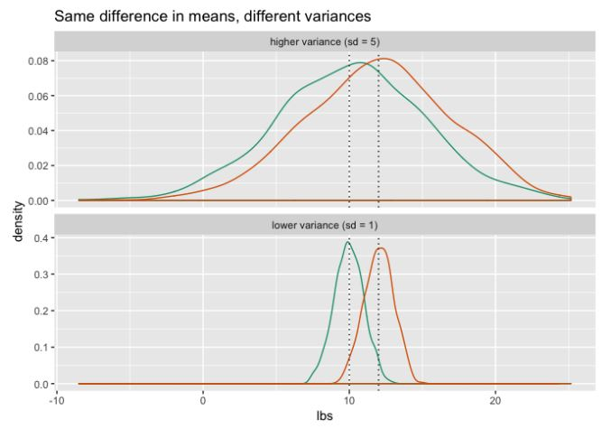
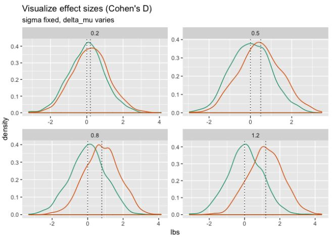

<style type="text/css">
p{ /* Normal  */
   font-size: 14px;
   line-height: 18px;}
body{ /* Normal  */
   font-size: 14px;}
td {  /* Table  */
   font-size: 12px;}
h1 { /* Header 1 */
 font-size: 26px;
 color: #4294ce;}
h2 { /* Header 2 */
 font-size: 22px;}
h3 { /* Header 3 */
 font-size: 18px;}
code.r{ /* Code block */
  font-size: 12px;}
pre { /* Code block */
  font-size: 12px}
#table-of-contents h2 {
  background-color: #4294ce;}
#table-of-contents{
  background: #688FAD;}
#nav-top span.glyphicon{
  color: #4294ce;}
#postamble{
  background: #4294ce;
  border-top: ;}
</style>

```{r echo=FALSE, warning=F, message=F}
if(!require(easypackages)){install.packages("easypackages")}
library(easypackages)
packages("tidyverse", "pwr", prompt = TRUE)
options(digits = 3)

setwd("~/GitHub/Statistics")
```

# Introduction

Illustrate and explain  Cohen’s D for planning difference-of-mean experiments. Basic statistics but explained so anyone can understand it!

# Estimating Sample Size

Let’s imagine you are testing a new weight loss program and comparing it so some existing weight loss regimen. You want to run an experiment to determine if the new program is more effective than the old one. You’ll put a control group on the old plan, and a treatment group on the new plan, and after three months, you’ll measure how much weight the subjects lost, and see which plan does better on average.

The question is: how many subjects do you need to run a good experiment?

In order to answer that question, you generally need to decide several things:

- __The probability of a false positive that you are willing to tolerate__. This is the probability of declaring that the new weight loss plan is better, when it’s actually not. Also known as the significance level threshold, or “p-value threshold” of the experiment.
- __The probability of detecting a true positive that you want to achieve__. This is the probability of correctly detecting that the new weight loss plan is better than the original, when it actually is. Also known as the power of the experiment. You can also think of it as one minus the probability of a false negative.
- __How much of a difference you are willing to call a “real” difference__. If people on the new plan lose on average five more pounds every three months than they did on old plan, then the new plan is an improvement over the old one. On the other hand, if the average weight loss over three months on the two plans differs by less than a pound, you may not want to call that a “real” difference; you may want to consider the two plans “about the same.” The difference in average weight loss between the two plans is also known as the effect size observed in the experiment.

Let’s say that you are willing to tolerate a probability of either false posititve or false negative of 1%. This means that you want a p-value threshold of 0.01, and a power of 0.99.

```{r eval=FALSE}
p_value <- 0.01
power <- 0.99
```

You also decide that you will call the new program “better” if the average weight loss at the end of the trial is two pounds or more greater on the new program than on the old.

# Cohen’s D: Normalized Effect Size

Not everyone on a program is going to lose exactly the same amount of weight; in fact, weight loss generally varies widely. Let’s say you know from experience that on average, people on the old program lose about 10 pounds after three months, and the standard deviation on the weight loss is about five pounds. This relatively wide standard deviation will make it harder to detect an average difference of two pounds than if the standard deviation were (miraculously) about one pound:

```{r, out.width = "500px", echo=FALSE}

```

_Cohen’s d_ is a measure of effect size for the difference of two means that takes the variance of the population into account. It’s defined as

$d = | μ1 – μ2 | / σ_{pooled}$

where σ~pooled is the pooled standard deviation over both cohorts.

$σ_{pooled} = √( σ_1^2 + σ_2^2 )$

Note that this formula assumes both cohorts are the same size.

The use of Cohen’s d for experimental design also assumes that the true standard deviation of the two treatment groups is about the same; only the mean differs.

Cohen suggested as a rule of thumb that `d = 0.2` is a small effect, `d = 0.5` is medium, and `d = 0.8` is large. [Wikipedia has a more detailed rule-of-thumb table.]9https://en.wikipedia.org/wiki/Effect_size#Cohen's_d) Here’s what those values of _d_ (plus one more) look like:

```{r, out.width = "500px", echo=FALSE}

```

# Cohen’s D and Physical Effect Sizes

Map _d_ to meaningful physical units. If we assume that subjects on the new program will have about the same variance in weight loss as people on the old program, we can estimate the minimum d that we’d like to detect.

```{r}
# in pounds
sigma <- 5
delta_mu <- 2

(d_minimum <- delta_mu/sigma)
```

Can now estimate how many subjects we need per group, using the `pwr.t.test()` function from the `pwr` package. This function has four primary arguments:

- number of subjects per cohort,
- effect size (as _d_)
- significance level
- power

Given any three (and the fourth as NULL), `pwr.t.test()` estimates the value of the fourth. We’ll do a two-sided, two-sample test (compare two populations and check if the means are different).

```{r}
n_per_cohort <- NULL # what we want to know
effect_size <- d_minimum
p_value <- 0.01

power <- 0.99

type <- "two.sample"  # default value
alternative <- "two.sided"# default value

## given any three you can estimate the fourth
(estimate <- pwr.t.test(n = n_per_cohort, d = effect_size, sig.level = p_value, power = power,
                      type = type, alternative = alternative))
```
 
It is estimated  you will need about 303 subjects in each cohort (or 606 subjects total) to reliably detect a difference of two pounds average weight loss between the two groups of subjects (where “reliably” means 1% chance of a false positive and 1% chance of a false negative).

If this seems like too large an experiment, then you may need to relax your error bounds, or test for a larger effect size; whichever is more appropriate to your situation. If you are willing to reduce the power of your test (but leave the significance level where it is), plotting the output of pwr.t.test will give you a helpful power analysis graph.

```{r}
# you could just plot it, but I want the data
eplot <- plot(estimate)
powanal <- eplot$data

# a function that returns the approx sample size for a given power
panal_fun <- approxfun(powanal$power, powanal$sample_sizes)

powers <- c(0.9, 0.95)
nframe <- data.frame(power=powers, sample_sizes=ceiling(panal_fun(powers)))
nframe <- transform(nframe, label = paste("approx n =", sample_sizes))

ggplot(powanal, aes(x=sample_sizes, y=power)) + geom_point() + geom_line(size = 0.1, color="red") + 
  geom_hline(yintercept = nframe$power, linetype=3, color="darkblue") + 
  geom_vline(xintercept = nframe$sample_sizes, linetype=3, color="darkblue") + 
  geom_text(data=nframe, aes(x = 300, y = power, label=label)) + 
  ggtitle("Two-sample t test power calculation",  subtitle = "n is sample size per group")
```

If you want to detect an effect size of at least two pounds to a significance of 0.01 and a power of 0.95, you need 226 subjects per group, or 452 subjects total. If you can settle for a test with a power of 0.9, then you only need 188 subjects per group, or 376 subjects total.

# Estimating Minimum Detectable Effect Size for Given Sample Size

What often happens in real life is that the experimenter only has access to as many subjects as they can gather; they then hope that the set is large enough to detect any usedful difference. You can use `pwr.t.test()` to estimate the efficacy of your experiment in this situation, as well.

Suppose you are only able to gather 200 subjects (100 subjects for each diet plan). How big a difference can your experiment detect?

```{r}
n <- 100
(estimate <- pwr.t.test(n = n, d = NULL, sig.level = p_value, power = power, type = type, alternative = alternative))
```
```{r}
# how large an effect in pounds?
(delta_mu <- sigma * estimate$d)
```

An experiment of this size, with a desired significance of 0.01 and a desired power of 0.99, can only reliably detect an effect size of about 3.5 pounds or larger. Lowering the test power to 0.8 will lower the minimum detectable effect size to about 2.5 pounds; this means that even if the new diet truly improves average weight loss by about 2.5 pounds over three months, your experiment will have a 20% chance of failing to detect it.

# Minimum Detectable Effect Size as a Function of Experiment Size

Assuming that you want to keep your error bounds as they are, and you can gather a suitable number of subjects at will, what is the minimum detectable effect size for a given sample size? You can estimate that using `pwr.t.test()`, too.

```{r}
sample_sizes <- seq(from = 50, to = 500, by = 50)

# a function to get the effect size as d
get_effect_size <- function(n, sig_level = 0.01, power = 0.99) {
  test_results <- pwr.t.test(n, NULL, sig_level, power)
  test_results$d
}

# estimate d for a range of sample sizes
dvec = vapply(sample_sizes, function(n) {get_effect_size(n)}, numeric(1))

# convert dvec into approximate difference in pounds
# assuming both populations have the same sigma
sigma <- 5
diff_frame <- data.frame(n = sample_sizes, delta_lbs = dvec * sigma)

# what's the approximate sample size (per cohort) to detect a difference of 3 pounds?
(n_3 <- ceiling(approx(diff_frame$delta_lbs, diff_frame$n, 3)$y))
```
```{r}
nframe <- data.frame(n = n_3, delta_lbs = 3, label = paste("approx n =", n_3))

ggplot(diff_frame, aes(x=n, y=delta_lbs)) + geom_point() + geom_line(size = 0.1, color="red") + 
  geom_hline(yintercept = 3, color="darkblue", linetype=3) + 
  geom_vline(xintercept = n_3,  color="darkblue", linetype=3) + 
  geom_text(data = nframe, aes(y = 1.5, label=label)) + 
  ylab("Minimum detectable effect size (pounds)") +
  ggtitle("Estimated minimum detectable effect size (pounds)")
```

To detect an average weight loss difference of three pounds to a significance of 0.01 and a power of 0.99, you will need about 139 subjects per group, or 278 total.

A general rule of thumb is that for a given set of error bounds, if you you want to halve the effect size you want to measure (go from detecting a difference of three pounds to 1.5 pounds), you need four times the data (from 139 subjects per group to 556 subjects per group).
This analysis assumes that both populations have about the same standard deviation of 5 pounds. If you suspect that the new weight loss program might have higher variance than the old one, then you should assume a higher pooled standard deviation, which means a smaller d, which means you will need more subjects.

# Testing Differences in Rates

For testing the difference in rates of two processes, use Cohens’ h. The function ES.h calculates the appropriate h for a desired difference in rates, and the functions pwr.p.test(), pwr.2p.test(), and pwr.2p2n.test() help you estimate appropriate experiment sizes in different situations.

# Conclusion

Our overall point is that proper experiments need to have stated goals and documented plans before being executed. Power calculators help you properly design the experiment size.

Reference

http://www.win-vector.com/blog/2019/06/cohens-d-for-experimental-planning/
